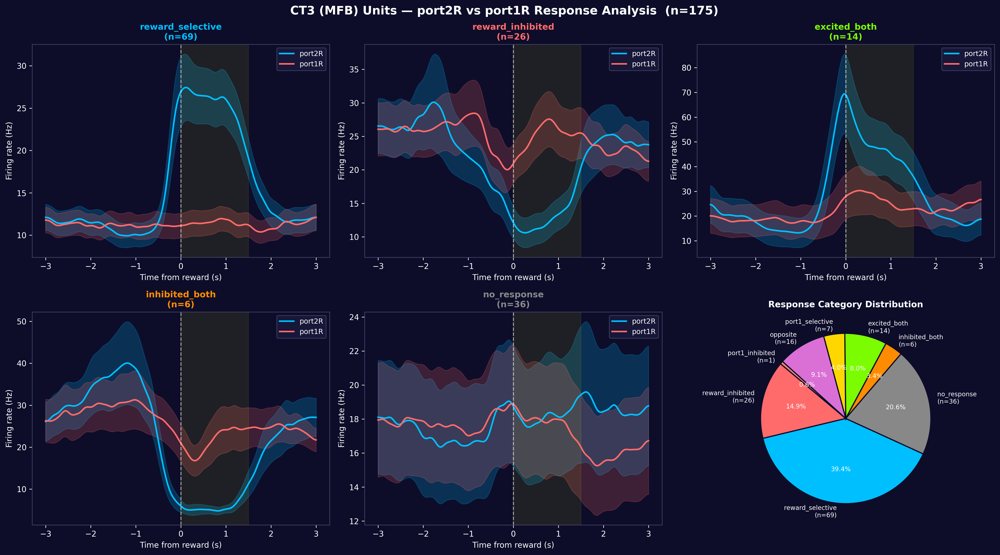

# NeuroViz

A desktop application for visualizing and analyzing neural electrophysiology data, built for neuroscience researchers who need to explore single-unit and population-level responses aligned to behavioral events.



## Overview

NeuroViz provides an interactive environment for exploring neuronal firing patterns across trials, events, and time. At its core is a powerful **PSTH (Peri-Stimulus Time Histogram)** engine with three complementary views — heatmaps, block averages, and mean curves — enabling researchers to quickly identify neural response patterns and dynamics across experimental conditions.

## Key Features

### PSTH Visualization (3 View Modes)
- **Heatmap** — Trial-by-time firing rate matrix for each event, with adjustable color limits and Gaussian smoothing
- **Block Average** — Mean firing rate per block of trials with amplitude and best-lag metrics, including Pearson correlation analysis
- **Mean PSTH** — Overlaid mean +/- SEM curves across events, with a diff mode for pairwise comparisons

### Synchronized Video Viewer
Load experimental video files (.mp4, .avi, .mkv) and view them frame-by-frame alongside neural activity traces. Navigate through events, track multiple units simultaneously, and align video frames to neural data with adjustable offset correction.

### AI Data Analysis Assistant
An integrated Claude AI chat (Ctrl+L) that has direct access to your loaded session data. Ask questions about your data in natural language — the assistant can write and execute Python code, generate plots, and run statistical analyses, all within the application.

### Spike Sorting Integration
View spike waveforms and autocorrelograms (ACG) for each unit. Supports spike-sorting table (sst.mat) with cell-type labels, probe depth, and CS/SS pair mapping.

### Multi-Session & Comparison Tools
- **Population Viewer** — Analyze group-level responses by cell type or custom selection
- **Cell Compare Window** — Compare individual units across sessions on shared axes with grouping support
- **Cross-Session Comparison** — Map events across sessions and compare population responses side by side

### Unit Browser
Sortable, filterable unit table with columns for cell type, probe depth, trial counts, and CS/SS pair links. Supports multi-selection for batch comparison and export.

## Installation

**Requirements:** Python 3.10+

```bash
# Create environment (recommended)
conda create -n neuro_viz python=3.10 -y
conda activate neuro_viz

# Install core dependencies
pip install pyqt5 pyqtgraph numpy scipy h5py

# Optional: video support
pip install opencv-python

# Optional: AI assistant
pip install anthropic
```

For the AI assistant, set your API key:
```bash
export ANTHROPIC_API_KEY="your-key-here"
```

## Usage

```bash
# Launch with file dialog
python main.py

# Or load a session directly
python main.py path/to/new_res.mat
```

### Supported Data Formats
- **New format** — `new_res.mat` containing firing rate matrix, timestamps, triggers, and spike-sorting data
- **Legacy format** — `res.mat` with companion `T_bin.mat` and `sst.mat` files

### Keyboard Shortcuts

| Key | Action |
|-----|--------|
| `1` / `2` / `3` | Heatmap / Blocks / Mean PSTH view |
| `←` / `→` | Previous / next unit |
| `D` | Toggle diff mode (Mean PSTH) |
| `V` | Open video + neural viewer |
| `X` | Export unit to Cell Compare window |
| `N` | Export unit to new Cell Compare window |
| `P` | Open CS/SS pair comparison |
| `C` | Open Python console |
| `Ctrl+L` | Open AI assistant |
| `Ctrl+P` | Export to PDF |
| `Ctrl+O` | Load additional session |

## Dependencies

| Package | Purpose |
|---------|---------|
| PyQt5 | GUI framework |
| pyqtgraph | High-performance plotting |
| NumPy | Array operations |
| SciPy | Signal processing, .mat file I/O |
| h5py | MATLAB v7.3 HDF5 file support |
| opencv-python | Video playback (optional) |
| anthropic | AI assistant (optional) |

## License

This project is provided as-is for research purposes.
